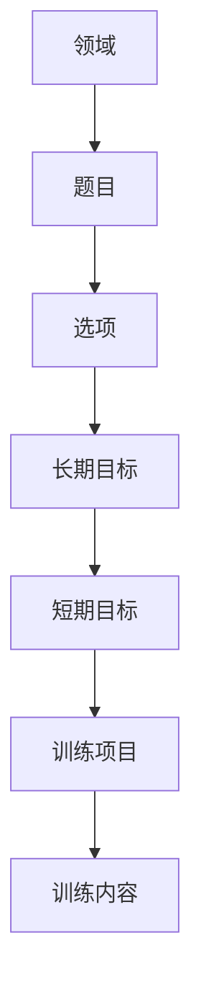

# PEP3 IEP 素材库实施方案

更新时间：2026-05-13

## 1. 目标

PEP3 的素材库只保留一套，围绕“测评题目选项 -> 长期目标 -> 短期目标 -> 训练内容”展开。

核心原则：

1. 题目选项直接关联长期目标。
2. 长期目标下面可新增多个短期目标。
3. 短期目标下面可新增多个训练内容。
4. 训练内容必须带一个 `训练项目` 字段。
5. 总 IEP、月计划、周计划都从这套素材逐级生成，不再拆三套素材库。

## 2. 推荐数据结构

### 素材主表

- 领域
- 题目
- 选项
- 长期目标
- 短期目标
- 课程形式
- 训练项目
- 训练内容
- 状态

### 关系

## 3. 生成逻辑

### 总 IEP

总 IEP 只保留：

- 领域
- 长期目标
- 短期目标
- 课程形式

建议规则：

- 题目选项先映射到长期目标。
- 0 分、1 分优先生成干预型长期目标。
- 2 分通常不作为训练型目标，可作为维持、泛化、巩固类目标。
- 总 IEP 不直接展示训练内容。

### 月计划

月计划从总 IEP 下钻，保留：

- 领域
- 长期目标
- 短期目标
- 训练内容
- 课程形式

建议规则：

- 月计划的短期计划从总 IEP 的短期目标中挑选。
- 课程形式跟随短期目标。
- 月计划是训练安排层，不是重新发明目标层。

### 周计划

周计划再从月计划下钻，保留：

- 训练项目
- 训练内容

建议规则：

- 同一个短期目标可以拆成多个训练项目。
- 同一个训练项目可以挂多个训练内容。

## 4. 选项体系

### PEP3 核心测评

标准选项建议保持：

- 0 分
- 1 分
- 2 分

### 儿心/家长报告类

如果后续扩展到儿心、PB、PSC、AB 这类题库，建议单独一套题库逻辑，不和 PEP3 混表。

原因：

- 题目含义不同。
- 选项含义不同。
- 和 IEP 的映射方式不同。

## 5. 导入规则

### 下拉选择

导入模板里建议做成联动下拉：

- 先选领域
- 再选题目
- 再选选项
- 再填长期目标
- 再补短期目标、课程形式、训练项目、训练内容

### 校验规则

- 题目必须属于所选领域。
- 短期目标为空时，不允许填课程形式。
- 填训练项目或训练内容时，短期目标必须存在。
- 训练项目和训练内容必须同时填写。
- 状态为空时，默认启用。

### 去重规则

- 同批导入中，`领域 + 题目 + 选项 + 长期目标` 视为同一条长期目标。
- 相同长期目标下，不同短期目标可继续追加。
- 相同短期目标下，不同训练项目和训练内容可继续追加。
- 空格、换行、Tab 不影响识别。
- 不做旧数据兼容，旧字段直接淘汰。

## 6. Excel 模板建议

模板字段建议固定为：

1. 领域
2. 题目
3. 选项
4. 长期目标
5. 短期目标
6. 课程形式
7. 训练项目
8. 训练内容
9. 状态

填写说明建议写清：

- 领域和题目必须从下拉选。
- 题目下拉要联动当前领域。
- 选项只保留 0 分、1 分、2 分。
- 长期目标是最小训练目标承载层。
- 短期目标和训练内容是继续展开层。

## 7. 建议的运营录入方式

建议按这个顺序维护：

1. 先录领域下的题目。
2. 再录题目选项对应的长期目标。
3. 再给长期目标补多个短期目标。
4. 再给短期目标补训练项目和训练内容。

这样后续 AI 才能按测评结果自动匹配：

- 测评结果 -> 长期目标
- 长期目标 -> 短期目标
- 短期目标 -> 训练项目/训练内容

## 8. 示例

| 领域 | 题目 | 选项 | 长期目标 | 短期目标 | 课程形式 | 训练项目 | 训练内容 | 状态 |
|---|---|---:|---|---|---|---|---|---|
| 小肌肉 | （31）指示拼块正确的位置 | 0分 | 能在提示下完成拼块位置辨识 | 在视觉提示下能匹配相同颜色拼块 | 个训 | 拼图训练 | 2块拼图配对 | 启用 |
| 小肌肉 | （31）指示拼块正确的位置 | 0分 | 能在提示下完成拼块位置辨识 | 在视觉提示下能匹配相同颜色拼块 | 个训 | 拼图训练 | 4块拼图配对 | 启用 |

这两行应当被识别成：

- 1 条长期目标
- 1 条短期目标
- 2 条训练内容

## 9. 结论

PEP3 这条线不需要 3 套素材库。  
更稳的方案是：

1. 一套素材库。
2. 一条明确的目标拆解链路。
3. 一个模板联动导入入口。
4. 生成时按总 IEP、月计划、周计划分层输出。

