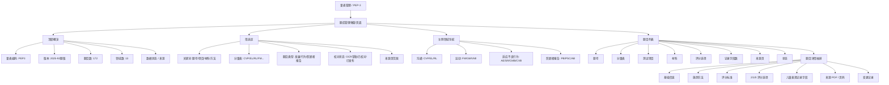
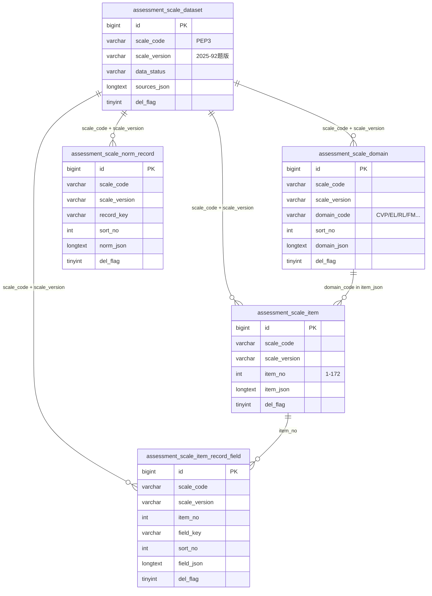
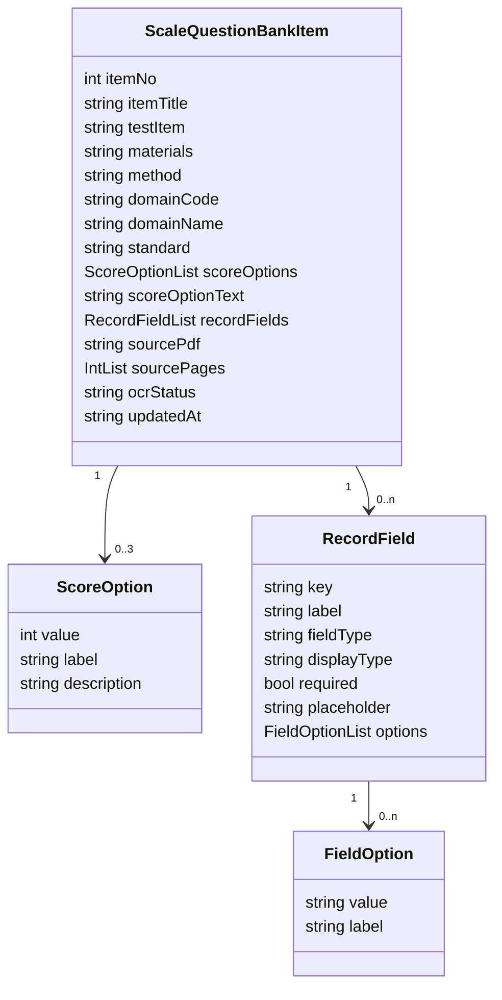
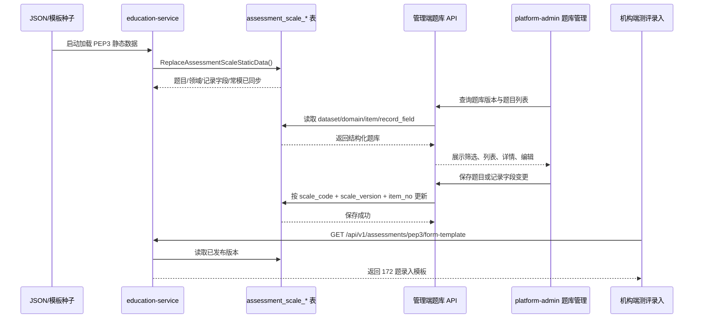
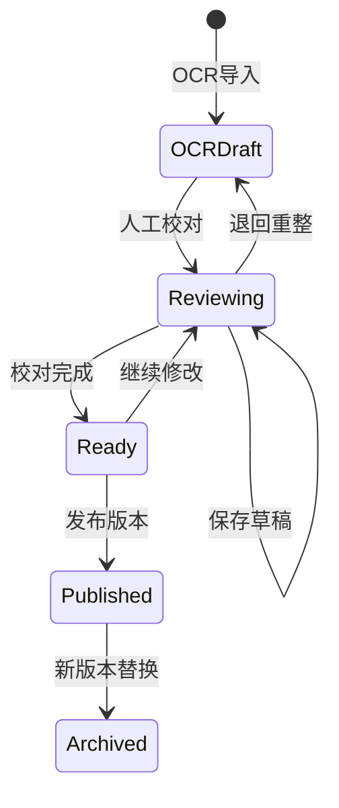

# PEP3 题库管理设计图

本文基于当前 PEP3 静态题库结构设计题库管理页面与数据关系。现有数据来源包括：

- `docs/pep3-item-bank-simplified-draft.json`：172 道 PEP3 测试题。
- `docs/pep3-score-domain-map.json`：13 个分量表/领域定义。
- `pkg/pep3template/record_fields.go`：逐题儿童表现记录字段。
- `assessment_scale_*` 表：题库、领域、记录字段、常模的持久化结构。

## 1. 管理端页面结构图

## 2. 核心数据关系图

## 3. 题目 JSON 结构

题目管理的主编辑对象是 `assessment_scale_item.item_json`，当前 PEP3 题目字段如下：

## 4. 数据流设计图

## 5. 建议的题库管理功能分区

| 区域 | 功能 | 对应数据 |
|---|---|---|
| 版本概览 | 显示 `PEP3`、`2025-92题版`、题目数、领域数、来源文件、数据状态 | `assessment_scale_dataset` |
| 领域导航 | 按 13 个分量表聚合题目，显示题数和满分 | `assessment_scale_domain.domain_json` |
| 题目列表 | 查看题号、测试项目、材料、评分选项、来源页、校对状态 | `assessment_scale_item.item_json` |
| 题目详情 | 查看/编辑材料、施测方法、评分标准、来源页 | `ScaleQuestionBankItem` |
| 评分选项 | 管理 2/1/0 或 NA 说明 | `scoreOptions` / `scoreOptionText` |
| 记录字段 | 管理文本、数字、单选、多选、优势手/眼等扩展记录 | `assessment_scale_item_record_field.field_json` |
| 常模数据 | 只读查看或单独维护常模换算表 | `assessment_scale_norm_record.norm_json` |
| 发布控制 | OCR 草稿、已校对、已发布、停用 | 建议新增版本状态或复用 `data_status` |

## 6. 编辑与发布状态

## 7. PEP3 分量表分组

| 组合 | 分量表 | 题数 |
|---|---|---:|
| 沟通 | CVP 认知（语言/语前）、EL 语言表达、RL 语言理解 | 77 |
| 运动 | FM 小肌肉、GM 大肌肉、VMI 模仿（视觉/动作） | 46 |
| 适应不良行为 | AE 情感表达、SR 社交互动、CMB 行为特征-非语言、CVB 行为特征-语言 | 49 |
| 照顾者报告 | PB 问题行为、PSC 个人自理、AB 适应行为 | 38 |

说明：前 10 个分量表由 172 道现场测评题映射；PB/PSC/AB 是照顾者报告原始分领域，不直接映射现场题号。

## 8. 落地建议

1. 先把平台端题库抽屉从 `pep3-static-question-bank.ts` 的 P1/P3 静态样例，改为调用后端完整题库接口。
2. 后端新增平台管理接口：列表、详情、保存题目、保存记录字段、版本发布。
3. 编辑时保留 `item_json` 的完整 JSON 结构，同时在 API 层展开为前端表单字段，避免前端直接编辑大段 JSON。
4. 对评分标准、施测方法、常模数据建议加“发布版本”控制，机构端测评只读取已发布版本。
